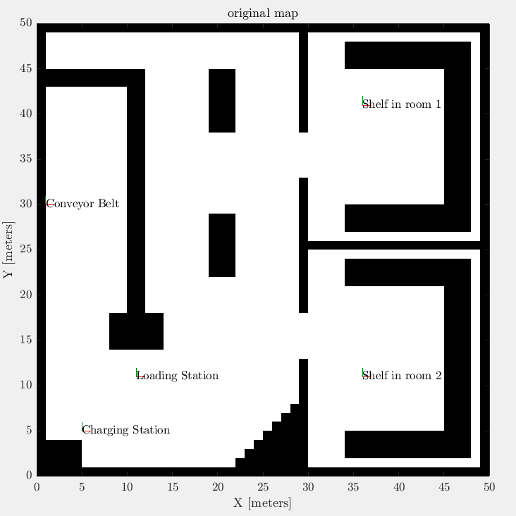
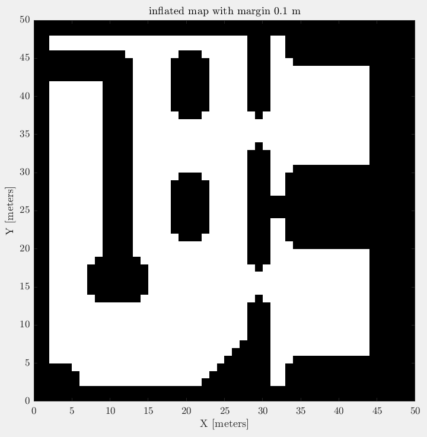
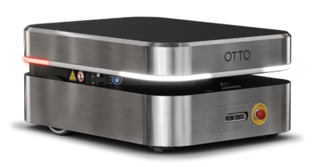
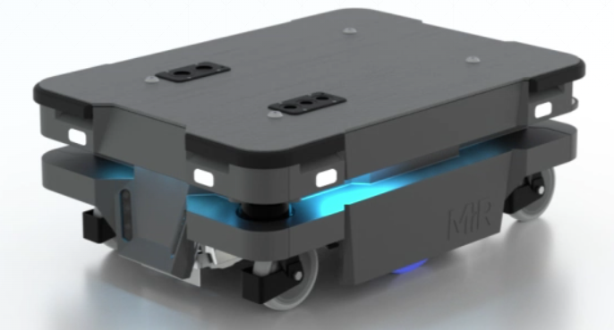
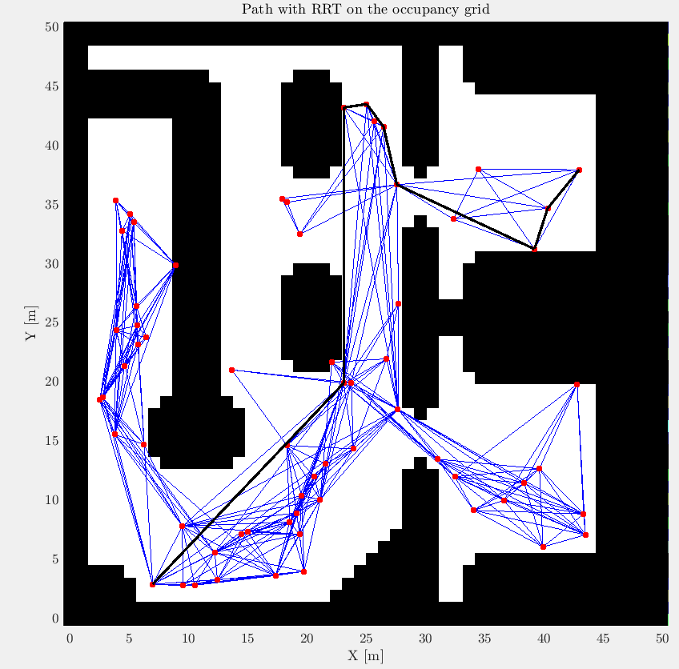
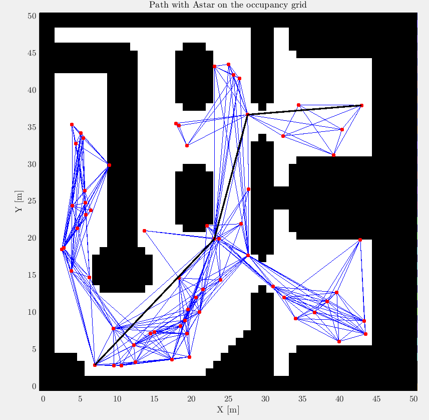

# Car-Like-Robot-in-a-Warehouse by Arsen Hudyma for the course of Field and Service Robotics

This project aims to control a car-like robot model in a warehouse environment composed of different rooms, in particular the main issues that have been adressed are

- Map
  The map is 2D and it was modelled as a occupancy grid, there is a "original" version of it and an inflated one (with respect to the obstacles)
- Robot
 - In this project the robot's model is a car-like one
 - Some kinematic parameters are retrieved via datasheets (they're present) of commercial ones so to constrain the motion of the robot (for example max linear velocity and so on...)
- Controller
  - The used controller is an input-output one and it's implemented based on two types of feedback
- Feedback
  - it's used the second and the fourth order of Runge-Kutta estimation
- Planner
  - RRT+A* is used to create a graph structure on the map (considering also the obstacles) and then to find a better bath via A* algorithm
  - Reed-Sheeps Curves are also implemented
  - Inside the initialization script of the simulink models there's the code to trajectory generation which considers also the physical limits of the robot

The code is basically plug and play, in fact you have just to execute the ***main.m*** file and choose what kind of map do you want, feedback and so on...

Some tips are that if you using one plannig method or another the destination point is different, if you want to change it then regarding RRT+A* is simple, just change the variable (consider if the goal position is inside of an obstacle or not). Instead regarding RS Curves you have to define more points along the path (like it's already done) just to be sure you're avoiding obstacles.

Regarding the gains of the controller, k1 and k2, I suggest you to use 5 or 6 as values for RS Curves and little bigger values if you're using RRT+A*

There's also present a ***pdf*** report in which everything is explained and also the results are shown in it ;)

Here's the two types of Maps:

Here insted the commercial robots that have been taken as inspo for the parameters:

Then there's the comparison of the results between RRT/RRG and A*:

